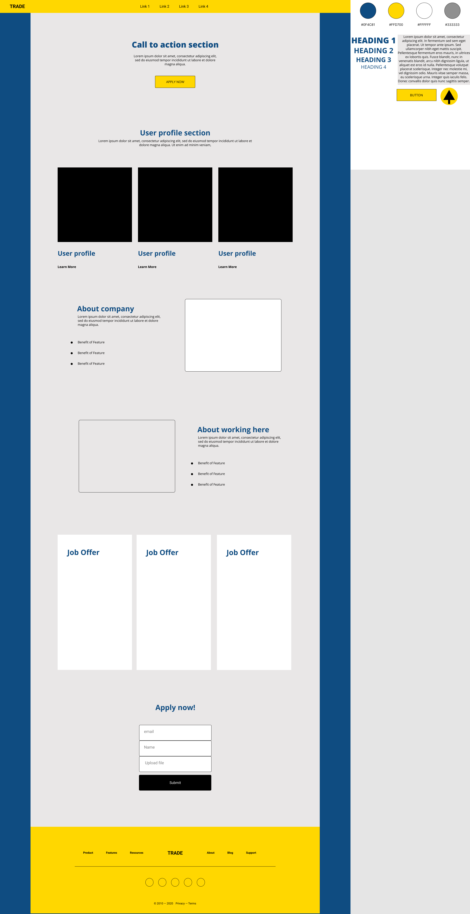
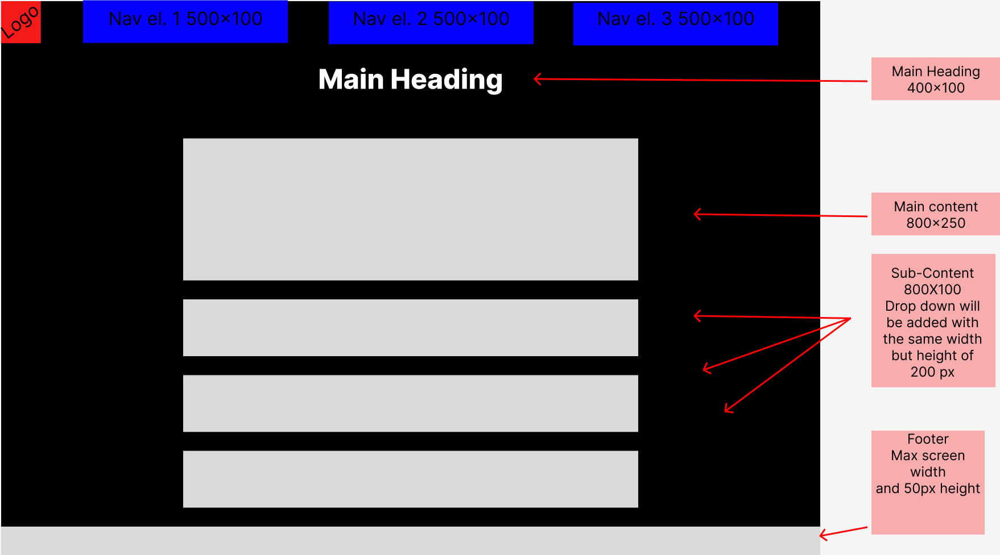

# Unit 15 Assignment Two

- [Unit 15 Assignment Two](#unit-15-assignment-two)
  - [Requirements](#requirements)
    - [Statement of User Requirements](#statement-of-user-requirements)
    - [Tooling](#tooling)
  - [Plan](#plan)
  - [Design](#design)
    - [Wireframes/Storyboards](#wireframesstoryboards)
    - [Typography](#typography)
    - [Colours](#colours)
    - [Design sheet](#design-sheet)
    - [Alternative Design](#alternative-design)
    - [Design Justification](#design-justification)
    - [Sources](#sources)
    - [Test Plan](#test-plan)
  - [Implementation](#implementation)
    - [Change Log](#change-log)
    - [Justification of Design Changes](#justification-of-design-changes)
  - [Test](#test)
    - [Validation Reports](#validation-reports)
    - [Test Results](#test-results)
      - [Functionality](#functionality)
      - [Performance](#performance)
    - [Rectification of Errors](#rectification-of-errors)
    - [Outstanding Issues](#outstanding-issues)
    - [User Feedback](#user-feedback)
      - [Design feedback from peers](#design-feedback-from-peers)
      - [Implementation feedback](#implementation-feedback)
  - [Review](#review)
    - [Response to Feedback](#response-to-feedback)
    - [Evaluation](#evaluation)
  - [References](#references)

## Requirements

### Statement of User Requirements

The web page will be a single page website that will be used to promote a fictional company called "Hot Beans Web". The web page will be used to promote the company to potential employees. It will provide information about the company and job offers. The page will also include a form to fill out to apply for a job.

- A profile of the company itself

- profiles of existing trainee web developers

- job specifications and required qualifications

- an on-line application form

- links to web development courses
  
### Tooling

- HTML, CSS and JS

- Visual Studio Code

- GitHub

## Plan

## Design

This section includes the design choices made for the website. It includes the wireframes, colour schemes, typography, navigation. While also providing a justification for the design choices made.

### Wireframes/Storyboards

Variation 1:

Variation 2:

### Typography

### Colours

### Design sheet

### Alternative Design

### Design Justification

### Sources

### Test Plan

## Implementation

### Change Log

### Justification of Design Changes

## Test

### Validation Reports

### Test Results

#### Functionality

#### Performance

### Rectification of Errors

### Outstanding Issues

### User Feedback

#### Design feedback from peers

|Name| Feedback |
|----|----------|
| Saul Coleman | Version 1- The layout is also not very adventurous. A single column with no variation is very boring. The section delighted to the main heading is also weirdly places and doesn't leave sufficient gaps between it and the rest of the content (or is otherwise too small, perhaps). Version 2- Looks much more professional and would be much easier for a user to use and a designer to understand. Content throughout the page is laid out in a dynamic way but has enough space between them to break the page up. Improves on the faults of V1 significantly. |
| Viktor Salihu| Design 1- The design is very basic and doesn't have much to it. The logo is all the way to the left, what is the problem with that is that people often use the logo as a home button and if the logo was positioned in the center, it will look more user-friendly.  Variation 2 is much better, 4 nav links which you can spread apart and put the logo between them. It is good that it has straight to the point to the top of the page, which is good for users because they don't have to scroll down to find the information they need. The website looks professional and sharp, which is what its needed for this type of website. |

#### Implementation feedback

## Review

### Response to Feedback

### Evaluation

## References

