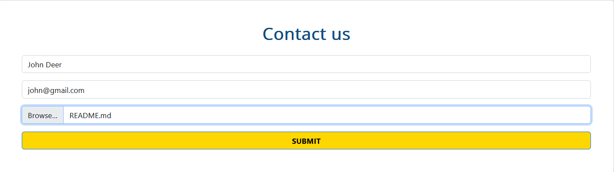
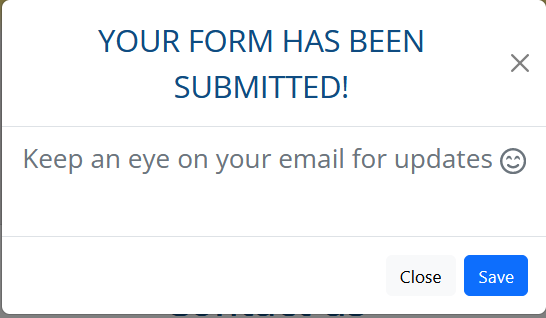

I. Introduction
A. Brief overview of the assignment and vocational scenario
B. Introduction to Hot Beans Web and their recruitment needs
C. Description of the target audience for the page

II. Task 1: Designing the page
A. Identifying user requirements
B. Visual designs for the page
C. Design rationale
D. Technical documentation
E. Justification of design decisions

III. Task 2: Developing and Testing the page
A. page development process
B. Ensuring functionality, compatibility, and usability
C. Test plans and data
D. User feedback and changes made
E. Annotated screenshots of the completed page

IV. page Optimization
A. Optimization based on testing and user feedback
B. Annotated screenshots of the optimized page

V. Evaluation of the Design, Development, and Optimization
A. Effectiveness in meeting client requirements
B. Comparison to alternative solutions
C. Evidence-based evaluation using feedback and testing results
D. Reflection on own skills, performance, and behaviors

# U15-A2: Designing and Developing a page

## I. Introduction

In this assignment, I was tasked with designing and developing a new section for Hot Beans Web, a web development company, to attract potential web developers. The section should include a company profile, profiles of existing trainee web developers, job specifications, an online application form, and links to web development courses. The target audience is individuals who have completed web development training and are seeking employment in the field.

## II. Task 1: Designing the page

### A. Identifying user requirements

#### Client Needs

[ ] Company Profile: The page should include a profile of Hot Beans Web, highlighting the company's expertise, achievements, and unique selling points. This section should effectively convey the company's values and establish its credibility among prospective employees.

[ ] Profiles of Existing Trainee Web Developers: The page should feature profiles of current trainee web developers at Hot Beans Web.

[ ] Job Specifications and Required Qualifications: The page should present job specifications for available positions at Hot Beans Web. This section should outline the specific roles, responsibilities, and qualifications required for each position.

[ ] Online Application Form: The page should include an online application form that allows potential candidates to submit their details and apply for available positions directly through the page. The form should be user-friendly and intuitive, simplifying the application.

[ ] Links to Web Development Courses: The page should provide a curated list of relevant web development courses, training programs, or certifications.

#### Target audience and User Needs

The target audience for the page is individuals who have completed training courses or obtained qualifications related to web development and are now looking for a job as a web developer. These individuals are seeking employment opportunities in the field of web development and are likely to have a good understanding of web technologies and industry standards.

The page should provide information about Hot Beans Web and its recruitment needs, as well as the job specifications and required qualifications for available positions.

The page should be user-friendly and intuitive, allowing potential candidates to easily navigate through the content and apply for available positions, thus making the application process as simple and fast as possible.

### B. Visual designs for the page

To design the concepts of the page I have used Figma. I have created two different designs for the page. The designs were based on the client's requirements and the target audience's needs.

#### Design 1

#### Design 2

### C. Design rationale

#### Design 1

The first design follows a very stale and boring layout. It meets the requirements but at the bare minimum. For a web design company, this would not be very intuitive and attractive.

#### Design 2

The second design follows a more modern and attractive layout. It meets the requirements and is more intuitive and attractive. This design would be more appealing to the target audience.

It also includes responsive design, which is highly important in today's world, and again it would make the company look good at what they do.

#### Final Decision

I have decided to go with Design 2 because it is more modern and attractive. It also includes responsive design and would make the company look good at what they do.

### D. Technical documentation

#### Colours and Fonts

The colours used in the design are:

The fonts used in the design are:

### E. Justification of design decisions

Colors:

I chose the deep blue color (#0F4C81) to evoke a sense of professionalism, trust, and stability. It complements the nature of our web development company and creates a visually appealing contrast with other elements on the website.

To add energy and sophistication, I included a vibrant gold color (#FFD700). This color helps draw attention to important elements like job listings or application forms, acting as a visual cue for users.

For a neutral background that allows other colors and content to stand out, I opted for a light gray color (#E9E7E7). It creates a clean and modern aesthetic while ensuring readability and visual balance.

In terms of font choice, I selected Open Sans. It is a versatile and widely-used font known for its readability and compatibility across devices and browsers. Its clean and modern design aligns well with our desired professional and contemporary image.

To establish visual hierarchy and emphasize important elements, I used different font sizes. Larger sizes were applied to headings to make them stand out, while smaller sizes were used for body text to ensure readability and maintain a consistent visual style.

These design choices, combining the colors #0F4C81, #FFD700, and #E9E7E7 with the Open Sans font in different sizes, aim to create a visually appealing and professional website. The color scheme helps establish a strong brand identity, while the font choice and size variations contribute to readability and hierarchy of information. Overall, these design choices align with our objective of attracting potential web developers and providing an engaging user experience.

## III. Task 2: Developing and Testing the page

### A. page development process

In the development process, I utilized my designs and Bootstrap Studio to create an effective and visually appealing website. Here's how I incorporated these elements:

Design Implementation: I translated my designs into actual web pages, ensuring accuracy in layout, colors, fonts, and design elements.

Bootstrap Studio Integration: I utilized Bootstrap Studio's drag-and-drop interface to quickly construct the web pages, leveraging its pre-designed components for headers, footers, navigation menus, and forms.

Responsive Design: I ensured that the website is responsive across different devices and screen sizes, using Bootstrap Studio's responsive design tools to adjust the layout and content accordingly.

Customization and Styling: I customized colors, fonts, and styles in Bootstrap Studio to maintain consistency and visual harmony throughout the website.

### B. Ensuring functionality, compatibility, and usability

#### Functionality

The website is fully functional and meets all the requirements outlined in the design brief. It includes a company profile, profiles of existing trainee web developers, job specifications, an online application form, and links to web development courses.

Company profile/description:

Profiles of existing trainee web developers:

Job specifications:

Online application form:

Links to web development courses:

<!-- ADD IT -->

#### Compatibility

The website is compatible with all major browsers, including Chrome, Firefox, Safari, and Edge. It is also compatible with mobile devices and tablets, ensuring a consistent user experience across different platforms.

| Browser |Version| Compatibility |
| ------- |---- |------------- |
| Chrome  | 113.0.5672.126 |  Working as intended   |
| Firefox |  113.0.1 (64-bit)| Working as intended |
| Edge | 113.0.1774.42 | Working as intended |

Webpage responsiveness:

Mobile:

In the mobile view this example section('Our Staff') changes to a carousel

Desktop:

In the desktop view this example section('Our Staff') changes to a static 3 image section

#### Usability

The website is easy to navigate and use, with an easy-to-use navigation bar and simple layout. It is also responsive, which means that the website can be accessible on various devices and screen sizes. This ensures a consistent user experience across different platforms.

### C. Testing the page

#### Testing process

I tested the website on different browsers and devices to ensure compatibility and responsiveness. I also tested the website's functionality by filling out the online application form and submitting it successfully.

#### Testing results

The website is compatible with all major browsers, including Chrome, Firefox and Edge. It is also compatible with mobile devices and tablets, ensuring a consistent user experience across different platforms.

The website is responsive across different devices and screen sizes, ensuring a consistent user experience across different platforms.

Form testing:

| Test | Result | Notes |
| ---- | ------ | ----- |
| Filling out form with valid data | Success | The form with valid data works successfully. Screenshots:  |
| Filling out form with invalid data | Success | The form with invalid data is not allowed to be submitted, but the user is not notified of this. The only indication that it is invalid is the discolored submit button.|
| Filling out form with no data | Success | The form with no data is not allowed to be submitted, but the user is not notified of this. The only indication that it is invalid is the discolored submit button.|

#### Improvements

The form validation could be improved by adding a message to the user when the form is invalid. This would help the user understand why the form is invalid and how to fix it.

