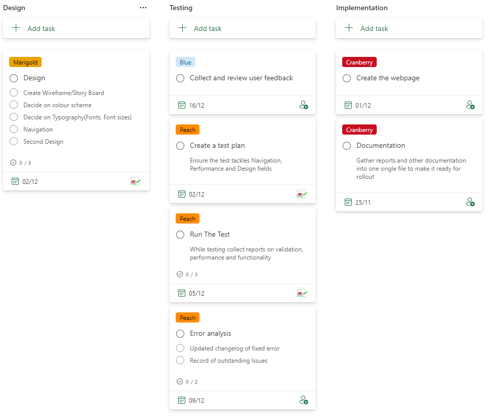

# Unit 15 Assignment Two

- [Unit 15 Assignment Two](#unit-15-assignment-two)
  - [Requirements](#requirements)
    - [Statement of User Requirements](#statement-of-user-requirements)
    - [Tooling](#tooling)
  - [Plan](#plan)
  - [Design](#design)
    - [Wireframes/Storyboards](#wireframesstoryboards)
    - [Colour Schemes](#colour-schemes)
    - [Typography](#typography)
    - [Navigation](#navigation)
    - [Alternative Design](#alternative-design)
    - [Design Justification](#design-justification)
    - [Sources](#sources)
    - [Test Plan](#test-plan)
  - [Implementation](#implementation)
    - [Change Log](#change-log)
    - [Justification of Design Changes](#justification-of-design-changes)
  - [Test](#test)
    - [Validation Reports](#validation-reports)
    - [Test Results](#test-results)
      - [Functionality](#functionality)
      - [Performance](#performance)
    - [Rectification of Errors](#rectification-of-errors)
    - [Outstanding Issues](#outstanding-issues)
    - [User Feedback](#user-feedback)
  - [Review](#review)
    - [Response to Feedback](#response-to-feedback)
    - [Evaluation](#evaluation)
  - [References](#references)

## Requirements

### Statement of User Requirements

The web page will be a single page website that will be used to promote a fictional company called "Hot Beans Web". The web page will be used to promote the company to potential employees. It will provide information about the company and job offers. The page will also include a form to fill out to apply for a job.

### Tooling

- HTML, CSS and JS

- Visual Studio Code

- GitHub

## Plan

## Design

### Wireframes/Storyboards

### Colour Schemes

### Typography

### Navigation

### Alternative Design

### Design Justification

### Sources

### Test Plan

## Implementation

### Change Log

### Justification of Design Changes

## Test

### Validation Reports

### Test Results

#### Functionality

#### Performance

### Rectification of Errors

### Outstanding Issues

### User Feedback

- verbatim
- sourced
= x2

## Review

### Response to Feedback

### Evaluation

## References

